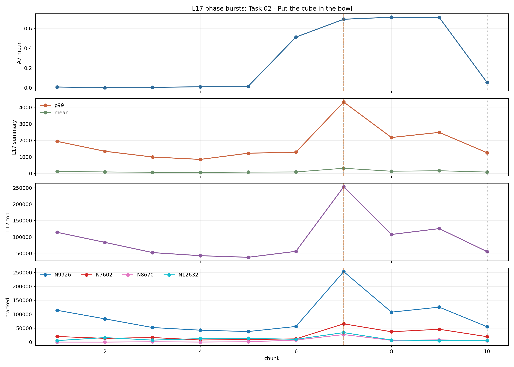
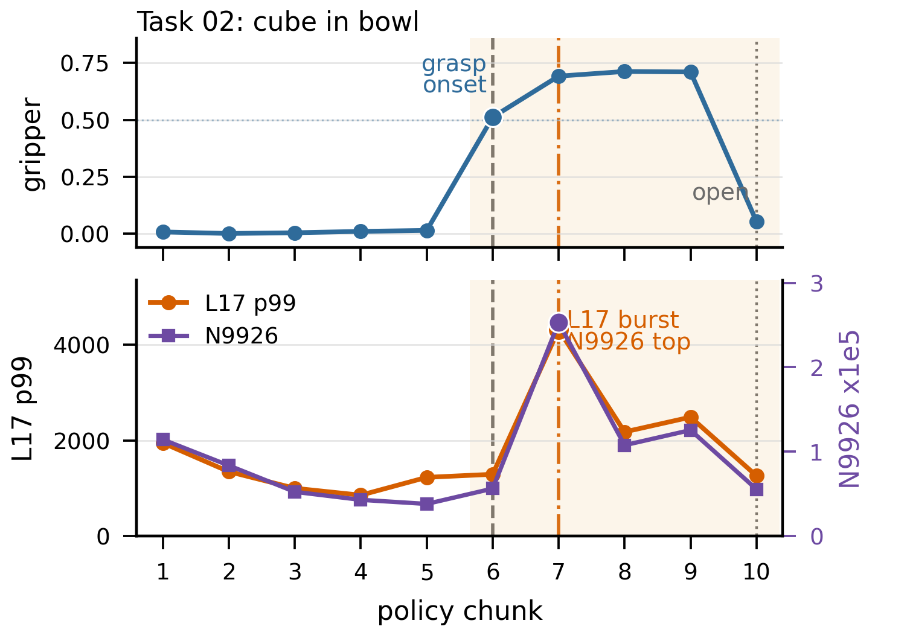

# TAROS 2026 Submission 93: L17 Exploratory Evidence

This repository contains the public evidence snapshot for the exploratory L17 activation findings reported in TAROS 2026 submission 93, **“Investigating Internal Phase Signals in VLA-Based Pick-Up Manipulation for Cross-Robot Adaptation.”**

> [!IMPORTANT]
> This is a frozen, manuscript-stage **exploratory evidence snapshot**, not a
> live or comprehensive project record. It documents the defined 20-execution
> historical analysis and its additive provenance audit. It makes no statement
> about the existence, status, direction, or results of work outside this
> boundary, and no such inference should be drawn from its silence.

> [!CAUTION]
> The 1,311 chunks, 99 action-command windows, and 137 retained candidates are
> nested or selected observations within **20 task executions**. They are not
> 1,311, 99, or 137 independent experimental replications. Read
> `SCOPE_AND_LIMITATIONS.md` before using the artifacts or counts.

## Figure 1 provenance at a glance

Both panels below use the same Task 02 execution and the same 10 policy chunks.
They are different historical visualizations, not different experiments.

| Recovered pre-specialization batch overview | Paper-specialized Figure 1 |
| --- | --- |
|  |  |
| Standard four-row output preserved in a 2026-06-11 Git tree snapshot. It marks the formal close/burst at chunk 7 and release at chunk 10; it has no 0.5 `grasp onset` annotation. | Specialized two-row output created on 2026-06-24 and embedded in the paper. It additionally marks executor-interpreted closure-command onset at chunk 6 using the upstream per-action `A7 > 0.5` boundary. The formal close event remains chunk 7. |

The comparison isolates a visualization change: it does not change the event
table, the underlying action trace, or the L17/N9926 values. Exact blob, file,
pixel, and paper hashes are in `audit/figure1_provenance.json`. The recovered
four-row blob was also reproduced byte-for-byte from the historical script and
retained raw Task 02 requests under the original Matplotlib 3.10.9 environment.

## Scope

This public snapshot is intentionally limited to the original 20-task exploratory L17 analysis used by the poster manuscript. It supports the following reported observations:

- 20 task executions and 1,311 policy chunks;
- 99 action-defined gripper-command events;
- 137 deduplicated L17 burst candidates;
- N9926 was the top-activated neuron in the highest-ranked burst candidate for all 20 tasks and in all 137 deduplicated burst candidates;
- burst magnitude alone did not determine task success, motivating a timing/organization interpretation rather than a task-success detector.

The gripper-command event definition used in the archived analysis begins a close window when the mean gripper command in an action chunk is at least 0.6 and ends it at the first subsequent chunk whose mean gripper command is at most 0.1.

Figure 1 uses `grasp onset` as operational shorthand for the onset of
executor-interpreted closure commands at the upstream per-action boundary
`A7 > 0.5`. It is not the formal chunk-mean close-event boundary, and it does
not assert observed physical contact, acquisition, or a stable grasp. Exact
image provenance and timing anchors are recorded in
`audit/figure1_provenance.json`.

The rank statement is descriptive rather than an enrichment test. A post-hoc
scan of the retained raw archive found N9926 rank 1 in 1,310 of all 1,311
chunks, so the phase-associated observation concerns its increase in magnitude
around action-defined close windows, not its identity or rank alone. The
additive audit and its limitations are recorded in `audit/README.md`.

## Defined snapshot boundary

This repository is not a rolling project log. It intentionally documents only
the frozen historical analysis unit and the audit artifacts identified here.
The repository is deliberately silent about anything outside that unit;
absence from this snapshot must not be treated as evidence that other work does
or does not exist.

## Public evidence files

The intended public snapshot contains:

- `analysis/analyze_l17_prompt_tasks.py`: historical analysis script;
- `SCOPE_AND_LIMITATIONS.md`: authoritative reading boundary for sample units,
  selection, event semantics, outcomes, figures, reproducibility, and excluded
  inferences;
- `data/task_summary.csv`: per-task chunk/event/burst summary;
- `data/task_summary_with_outcomes.csv`: task-level benchmark outcomes joined to the exploratory summary;
- `data/all_detected_events.csv`: detected gripper-command events;
- `data/all_l17_bursts.csv`: deduplicated L17 burst candidates;
- `reports/pick_put_l17_summary.md` and `reports/outcome_l17_summary.md`: archived derived summaries;
- `audit/`: additive post-hoc clarification of the N9926 baseline, event-window
  censoring, Figure 1 provenance and timing anchors, and Task 15 outcome
  semantics;
- `data/right_censored_event_adjudication.csv`: the seven close-associated
  windows retained at the episode boundary without an observed release;
- `figures/task01_l17_task_phase_overview.png` through `figures/task20_l17_task_phase_overview.png`: historical per-task A7/L17 phase-overview figures, including the representative Task02 figure used in the poster;
- `videos/taskXX_<BenchmarkTask>/main.mp4` and `viewport.mp4`: two views of each of the same 20 historical task executions.

See `PROVENANCE.md` for the evidence boundary and archival limitations.

The additive audit does not overwrite the historical CSVs, script, figures, or
videos and must not be read as evidence that was available in the frozen poster
analysis. The snapshot makes no claim about work outside its stated boundary.

## Interpretation boundary

The public evidence supports an **exploratory, correlational L17 phase-associated observation**. It does not establish that L17 is unique among layers, that the signal detects physical contact or acquisition, that it causally controls the policy, or that it predicts task success.

## Data availability note

The original request archives are not included in this public repository. They contain prompts, robot state, model outputs, request metadata, and machine-specific paths. The published videos provide visual execution context but do not replace the omitted request-level records or add new outcome annotations. This repository therefore exposes the historical derived evidence and execution recordings needed to inspect the poster-level observations without publishing the broader raw project archive.

